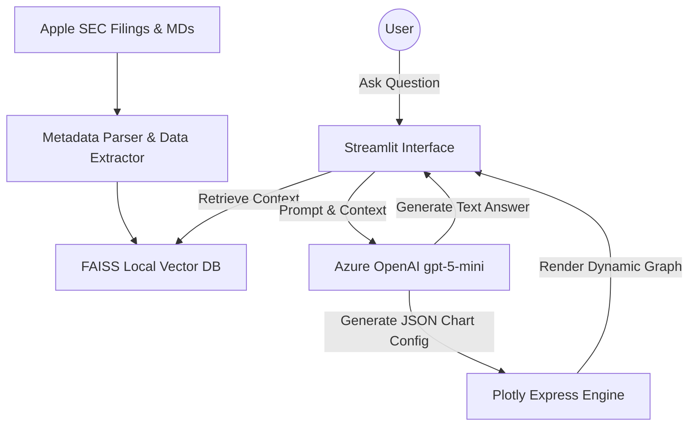

# 🍎 Apple Leadership Insight Agent

An intelligent, Retrieval-Augmented Generation (RAG) powered conversational agent designed to analyze and answer complex questions regarding Apple's corporate strategy, financial performance, and operational updates across Fiscal Years 2024 and 2025.

**Powered by:** Azure OpenAI (`gpt-5-mini` & `text-embedding-3-large`), LangChain, FAISS, and Streamlit.

---

## 🏗️ System Architecture & Data Flow

The project consists of two primary pipelines: **Asynchronous Data Ingestion** and **Interactive RAG Retrieval**.



---

## 📂 Directory Structure

The project is built around a secure, modular Python architecture.

```text
.
├── .env                  # Environment variables (Azure Configs, API versions)
├── data/                 # Raw Input Data (Included in repo for easy, zero-setup usage)
│   ├── FISCAL YEAR 2024/
│   │   ├── Strategy Notes/
│   │   ├── Quarterly Reports/
│   │   └── ...
│   └── FISCAL YEAR 2025/
├── db/                   # Persistent FAISS vector db (Included in repo for easy, zero-setup usage)
│   └── faiss_index/      # Generated FAISS indexed tensors
├── main.py               # CLI Entry point for backend ingestion engine
├── app.py                # Streamlit Frontend application
├── requirements.txt      # Python dependencies
└── src/
    ├── __init__.py
    ├── agent/            # AI and RAG Logic
    │   ├── llm_client.py # Manages connection to AzureChatOpenAI 
    │   └── rag_chain.py  # LangChain LCEL definitions and Retriever setup
    ├── config/           # Application Configuration
    │   └── settings.py   # Pydantic base settings and environment loading
    ├── embeddings/       # Embedding Models
    │   └── azure_embedder.py 
    ├── ingestion/        # Async Parsing & Extraction
    │   ├── document_parser.py # Async ingestion coordinator and metadata extractor
    │   ├── image_extractor.py # PyMuPDF + Tesseract integration for charts/images
    │   └── pdf_extractor.py   # PDFPlumber for precise text and table extraction
    └── vectorstore/      # Database Interaction
        └── faiss_store.py     # Parallel batch embedding execution and DB logic
```

---

### Data & Database Persistence in Git

I have added data files and vector db files both in git repo because it is very less size ,and it will be very easy to use directlty
but in standard practice these we can keep in gitignore(or external storage)

---

## 📊 How Ingestion Works: Multi-Modal Extraction Strategy

To achieve the highest fidelity of RAG responses, standard text extraction is not enough. The asynchronous ingestion pipeline (`main.py --ingest`) performs a deep, multi-modal pass over Apple's corporate filings. It specifically targets the crucial financial data embedded inside complex table structures and layout images that standard retrieval systems miss.

1. **Rich Metadata Mapping:**
   - Instead of treating all chunks equally, the `document_parser.py` extracts the **Fiscal Year**, **Quarters (Q1-Q4)**, and **Document Types** (10-K, 10-Q, Earnings) directly from the directory paths and filenames. 
   - This metadata is forcibly injected into the literal prompt context retrieved by FAISS (`[Source: Q1 2024, Type: 10-Q]`), giving the AI deterministic awareness of timeframe and fact source.

2. **Table Preservation (`pdf_extractor.py`):**
   - Uses `pdfplumber` to explicitly identify geometric table boundaries and extract them directly into aligned string representations. This prevents complex financial ledgers from turning into an unreadable mess of mashed text.

3. **Chart OCR Pipeline (`image_extractor.py`):**
   - Uses `PyMuPDF (fitz)` to isolate page images. It dynamically filters out UI icons or small logos by requiring a minimum `200x200` resolution. 
   - Surviving charts and graphs are dispatched to `pytesseract` via non-blocking asynchronous multi-threading to extract the embedded text.

4. **Parallel Embedding (`faiss_store.py`):**
   - Because Tesseract and PDF extraction generate large volumes of chunks (often 1000+), the indexing logic bypasses standard synchronous generation. It forcefully chunks the text into groups of 100 and relies on `asyncio.gather` and `tqdm` to fire parallel network requests to the Azure Embedding endpoint simultaneously.

5. **Dynamic Plotly Generation (`rag_chain.py` & `app.py`):**
   - The system utilizes a dual LLM chain approach. After the primary text answer is generated, the text is fed into a secondary `JsonOutputParser` chain guided by strict Pydantic rules (`ChartConfig`, `ChartData`).
   - If the AI detects statistical trends or comparisons in its own answer, it structures a JSON chart payload that is immediately handed off to `pandas` and `plotly.express` on the frontend. This seamlessly embeds dynamic Line, Bar, and Pie charts inside the Streamlit chat UI.

---

## 🚀 Getting Started

### Prerequisites
- Python 3.10+
- Tesseract OCR (`brew install tesseract` on MacOS, or `apt-get install tesseract-ocr` on Linux)
- Azure OpenAI Account with provisioned `gpt-5-mini` and `text-embedding-3-large` deployments.

### 1. Setup Environment
```bash
python -m venv .venv
source .venv/bin/activate
pip install -r requirements.txt
```

Ensure your `.env` contains:
```env
AZURE_OPENAI_ENDPOINT=https://your-endpoint.cognitiveservices.azure.com/
AZURE_OPENAI_API_KEY=your_key
AZURE_OPENAI_CHAT_DEPLOYMENT=gpt-5-mini
AZURE_OPENAI_EMBEDDING_DEPLOYMENT=text-embedding-3-large
AZURE_OPENAI_API_VERSION=2024-12-01-preview
```

### 2. Ingest Data
Run the asynchronous parsing and embedding pipeline.
```bash
python main.py --ingest
```
*You will see TQDM progress bars estimating OCR and batch embedding times.*

### 3. Launch the User Interface
Start the interactive application.
```bash
streamlit run app.py
```
*This will open the Apple Leadership Insight conversational UI in your browser at `http://localhost:8501`.*
